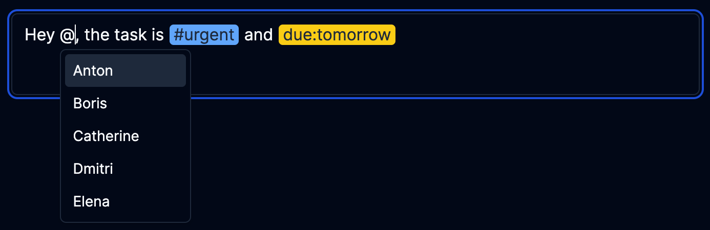

# lexical-beautiful-mentions

[![CI status][github-ci-action-image]][github-ci-action-url]
[![CodeQL status][github-codeql-analysis-action-image]][github-codeql-analysis-action-url]

[github-ci-action-image]: https://github.com/sodenn/lexical-beautiful-mentions/actions/workflows/ci.yml/badge.svg
[github-ci-action-url]: https://github.com/sodenn/lexical-beautiful-mentions/actions/workflows/ci.yml
[github-codeql-analysis-action-image]: https://github.com/sodenn/lexical-beautiful-mentions/actions/workflows/codeql-analysis.yml/badge.svg
[github-codeql-analysis-action-url]: https://github.com/sodenn/lexical-beautiful-mentions/actions/workflows/codeql-analysis.yml

A mentions plugin for the lexical editor. lexical is an extendable text editor for the web build by Meta. While the lexical playground offers a basic mentions plugin for demo purposes, this plugin is more advanced and offers the following features:

- **Customizable triggers**: Use characters, words or regular expressions as triggers for mentions.
- **Editing mentions outside of the editor**: Programmatically insert, delete, or rename mentions via the `useBeautifulMentions` hook.
- **Customizable mention style**: You can change the look of the mentions via the editor theme to match the style of your application.
- **Automatic spacing**: The plugin automatically adds spaces around the mentions, which makes it easier for the user to continue typing.
- **Adding new mentions**: You can allow users to create new mentions that are not in the suggestion list.
- **Flexible way to provide mentions**: You can use an async query function or a predefined list to provide mentions for the suggestion list.
- **Custom menu and menu item**: You can customize the look and behavior of the menu that displays the mention suggestions.

## Installation

To install the plugin, run the following command:

```bash
// with npm
npm install lexical-beautiful-mentions

// with yarn
yarn add lexical-beautiful-mentions
```

You also need to install the `lexical` and `@lexical/react`, which is a peer dependency of this plugin.

## Usage

Import the `BeautifulMentionsPlugin` plugin:

```tsx
import { BeautifulMentionsPlugin } from "lexical-beautiful-mentions";
```

Add the plugin to the lexical editor:

```tsx
const mentionItems = {
  "@": ["Anton", "Boris", "Catherine", "Dmitri", "Elena", "Felix", "Gina"],
  "#": ["Apple", "Banana", "Cherry", "Date", "Elderberry", "Fig", "Grape"],
  "due:": ["Today", "Tomorrow", "01-01-2023"],
};

// ...

return (
  <LexicalComposer>
    {/** ... */}
    <BeautifulMentionsPlugin
      items={mentionItems}
    />
    {/** ... */}
  </LexicalComposer>
);
```

### Customizable mention style

<br>
```tsx
import { BeautifulMentionsTheme } from "lexical-beautiful-mentions";
// ...
const beautifulMentionsTheme: BeautifulMentionsTheme = {
  "@": "px-1 mx-px ...", // use the trigger name as the key
  "@Focused": "outline-none shadow-md ...", // add the "Focused" suffix to style the focused mention
  // 👇 use a configuration object if you need to apply different styles to trigger and value
  "rec:": {
    trigger: "text-blue-400 ...",
    value: "text-orange-400 ...",
  },
}
const editorConfig = {
  // ...
  theme: {
    // ...
    beautifulMentions: beautifulMentionsTheme,
  },
};

// ...

return (
  <LexicalComposer initialConfig={editorConfig}>
    {/** ... */}
  </LexicalComposer>
);
```

### Add custom menu and menu item component

<br>
```tsx
const CustomMenu = forwardRef<
  HTMLElement, 
  BeautifulMentionsMenuProps
>(({ open, loading, ...props }, ref) => (
  <ul
    className="m-0 mt-6 ..."
    {...props}
    ref={ref}
  />
));

const CustomMenuItem = forwardRef<
  HTMLLIElement,
  BeautifulMentionsMenuItemProps
>(({ selected, ...props }, ref) => (
  <li
    className={`m-0 flex ... ${selected ? "bg-gray-100 ..." : "bg-white ..."}`}
    {...props}
    ref={ref}
  />
));

// ...

<BeautifulMentionsPlugin
  items={mentionItems}
  menuComponent={CustomMenu}
  menuItemComponent={CustomMenuItem}
/>
```

### Programmatically insert, delete, or rename mentions

```tsx
import {
  BeautifulMentionsPlugin,
  useBeautifulMentions,
} from "lexical-beautiful-mentions";

// ...

function MentionsToolbar() {
  const { removeMentions, insertMention } = useBeautifulMentions();
  return (
    <div className="grid gap-2 grid-cols-2">
      <Button onClick={() => removeMentions({ trigger: "#", value: "urgent" })}>
        Remove Mention
      </Button>
      <Button onClick={() => insertMention({ trigger: "#", value: "work" })}>
        Insert Mention
      </Button>
    </div>
  );
}

// ...

return (
  <LexicalComposer>
    {/** ... */}
    <BeautifulMentionsPlugin
      items={mentionItems}
    />
    <MentionsToolbar />
    {/** ... */}
  </LexicalComposer>
);
```

### Async query function

```tsx
const queryMentions = async (trigger: string, query: string) => {
  const response = await fetch(
    `https://example.com/api/mentions?trigger=${trigger}&query=${query}`
  );
  const data = await response.json();
  return data as string[];
};

// ...

return (
  <LexicalComposer>
    {/** ... */}
    <BeautifulMentionsPlugin
      triggers={["@", "#"]} // needed to tell the plugin when to call the query function
      onSearch={queryMentions}
    />
    {/** ... */}
  </LexicalComposer>
);
```
